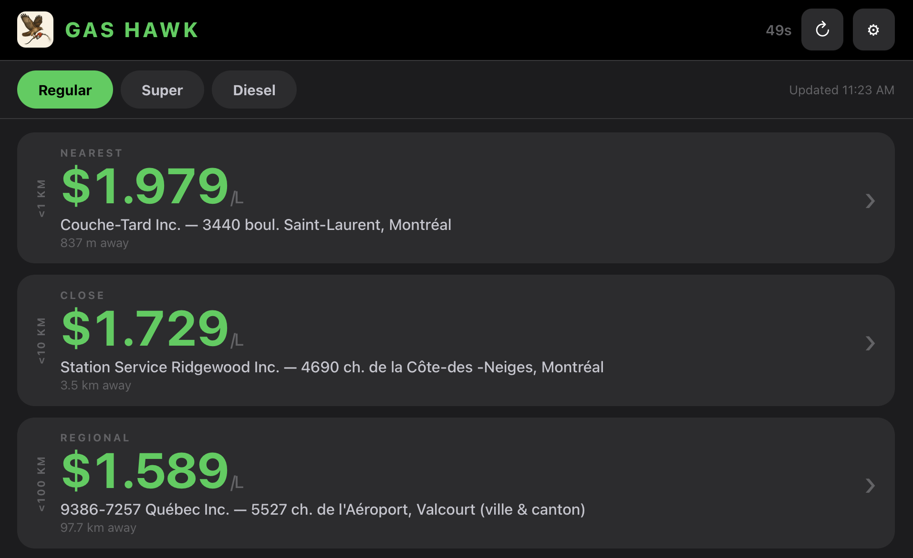

# Gas Hawk

A CarPlay-inspired gas price tracker for Quebec, built as a proof-of-concept web app. Designed for use while driving — big buttons, large fonts, zero confirmation dialogs.



## What It Does

Gas Hawk uses your current location to find the **cheapest gas price** in three distance rings:

| Ring | Label |
|------|-------|
| < 1 km | Nearest |
| < 10 km | Close |
| < 100 km | Regional |

Tap any card to get turn-by-turn directions to that station (Apple Maps on iOS, Google Maps everywhere else).

Data is sourced from the **Régie de l'énergie du Québec** — the same data that powers real-time price boards across the province — and refreshes automatically on a configurable interval.

## Features

- **3-zone price display** — instantly see the cheapest price near you, nearby, and regionally
- **Fuel type selector** — switch between Regular, Super, and Diesel right on the main screen
- **Auto-refresh** — configurable at 30 sec, 1 min, 2 min, or 5 min; countdown shown in the top bar
- **One-tap directions** — opens your default maps app with the destination pre-filled
- **Persistent settings** — fuel type and refresh interval are saved across sessions via `localStorage`
- **Offline-tolerant** — falls back gracefully through three data sources (see below)

## Getting Started

No build step, no dependencies. Just serve the files over HTTP/HTTPS.

```bash
# Using Node
npx serve .

# Using Python
python3 -m http.server 8080
```

Then open the local URL in your browser and allow location access when prompted.

> **Note:** Geolocation requires either `localhost` or an HTTPS connection. Opening `index.html` directly as a `file://` URL will not work.

## Data Source

Station data comes from the Régie de l'énergie du Québec's public GeoJSON feed:

```
https://regieessencequebec.ca/stations.geojson.gz
```

The feed covers ~2,200+ stations across Quebec and includes real-time prices for Regular (`Régulier`), Super, and Diesel at each location.

### Data Loading Fallback Chain

The app tries three sources in order, logging which one succeeded to the browser console:

1. **Direct fetch** from the Régie URL — works if the server returns CORS headers
2. **CORS proxy** via [corsproxy.io](https://corsproxy.io) — handles most browser cross-origin restrictions
3. **Local sample file** at `sample-data/stations.geojson` — bundled snapshot used as a last resort

Check the browser console (F12) to see which source loaded:
- `Loaded from remote URL` → live data, direct
- `Loaded via CORS proxy` → live data, proxied
- `Loaded from local sample file` → snapshot data (not live)

## Project Structure

```
gas-hawk/
├── index.html              # App shell and UI markup
├── style.css               # CarPlay dark theme
├── app.js                  # All application logic
├── sample-data/
│   └── stations.geojson    # Bundled data snapshot (fallback)
└── public/
    └── images/
        └── gas-hawk-icon.png
```

## Settings

Open the settings panel (⚙ button, top right) to configure:

- **Refresh Interval** — how often the app re-fetches prices: 30 sec / 1 min / 2 min / 5 min

The **fuel type** (Regular / Super / Diesel) is on the main screen for quick access while driving.

## Browser Compatibility

Requires a modern browser with support for:

- `DecompressionStream` (Chrome 80+, Safari 16.4+, Firefox 113+)
- `navigator.geolocation`
- ES2020+ (`??`, `?.`, `async/await`)

## Data Attribution

Prices sourced from the [Régie de l'énergie du Québec](https://www.regie-energie.qc.ca/). This project is an independent proof-of-concept and is not affiliated with or endorsed by the Régie.
